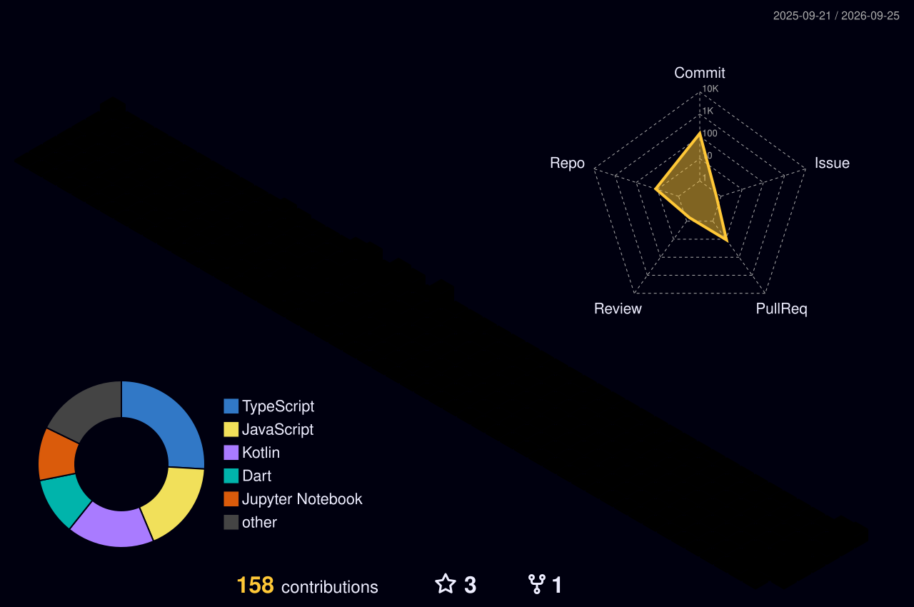

  
  
  

---

## Focus

- **Thesis (Computer Vision Lab):** adaptive fusion of **CLIP and DINOv2** for few-shot image classification
- **Applied research:** how classical ML breaks under **domain shift**, tested on real Bangladeshi factory fabric
- **Freelance:** AI assistants, automations, and small-data image classifiers

## Featured Projects

<table>
<tr>
<td width="50%" valign="top">

### Fabric Defect Domain Shift
Benchmarked 16 feature and classifier combinations on TILDA, then tested on a **self-collected real factory dataset**.
- Found a hidden failure: **specificity = 0.000** on defect-free fabric
- Ruled out 4 causes before finding the real one
- Recovered partly with 20 to 50 real examples

`Python` `scikit-learn` `LBP` `GLCM` `HOG`

[**View repository**](https://github.com/humaira228/fabric-defect-domain-shift)

</td>
<td width="50%" valign="top">

### Few-Shot CLIP and DINOv2 Benchmark
Compared 5 few-shot adapters on CIFAR-10, EuroSAT and DermaMNIST.
- **CLIP-LoRA: 95.8%** on CIFAR-10 at K=100 (zero-shot CLIP: 90.4%)
- Found an inverted-U link between zero-shot headroom and adaptation gain
- Built CLIP from scratch on 5k image-caption pairs

`Python` `PyTorch` `CLIP` `DINOv2`

[**View repository**](https://github.com/humaira228/Few-Shot)

</td>
</tr>
<tr>
<td width="50%" valign="top">

### EcoTrack
Health-scored navigation using live air quality data and an ML risk model.
Semi-finalist, Therap JavaFest 2025.

`Spring Boot` `React` `Flask` `PostgreSQL` `XGBoost`

</td>
<td width="50%" valign="top">

### SheShield
Women's safety Android app: voice and shake SOS, live GPS, encrypted audio, automatic SMS to contacts. 2.6 s average SOS response time.

`Kotlin` `Firebase` `Google Maps SDK`

</td>
</tr>
</table>

Also: **Ottalika** (building management with real-time chat) and **DeenOasis** (book rental platform)

## Tech Stack

 

 

## Contribution Graph (3D)

## GitHub Stats

 

 

